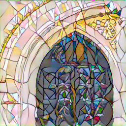
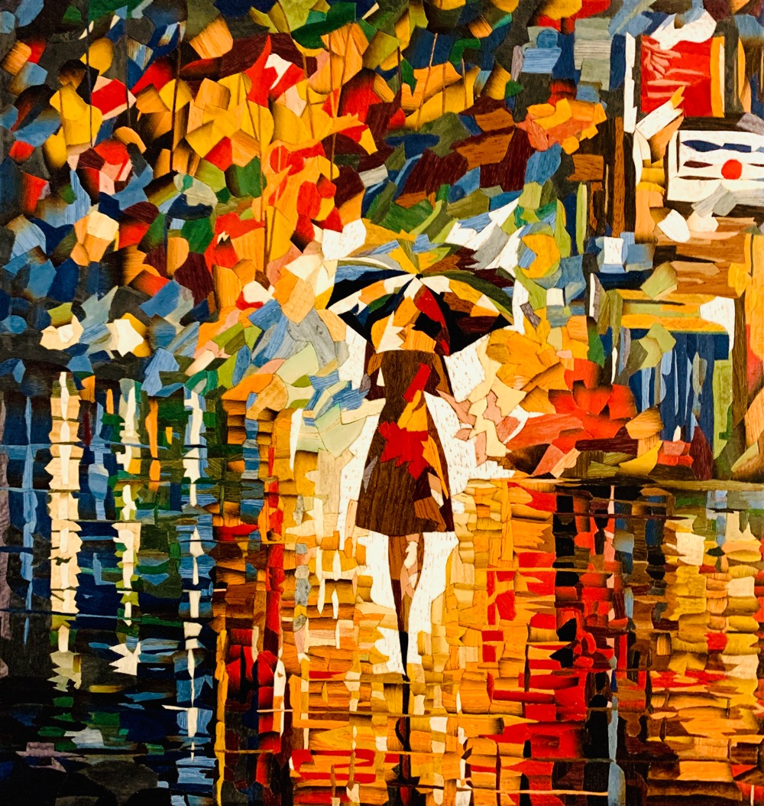
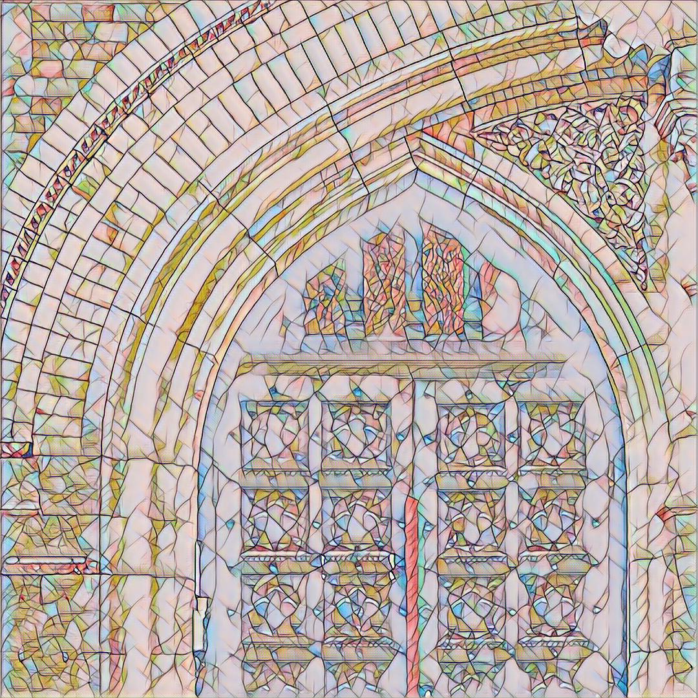
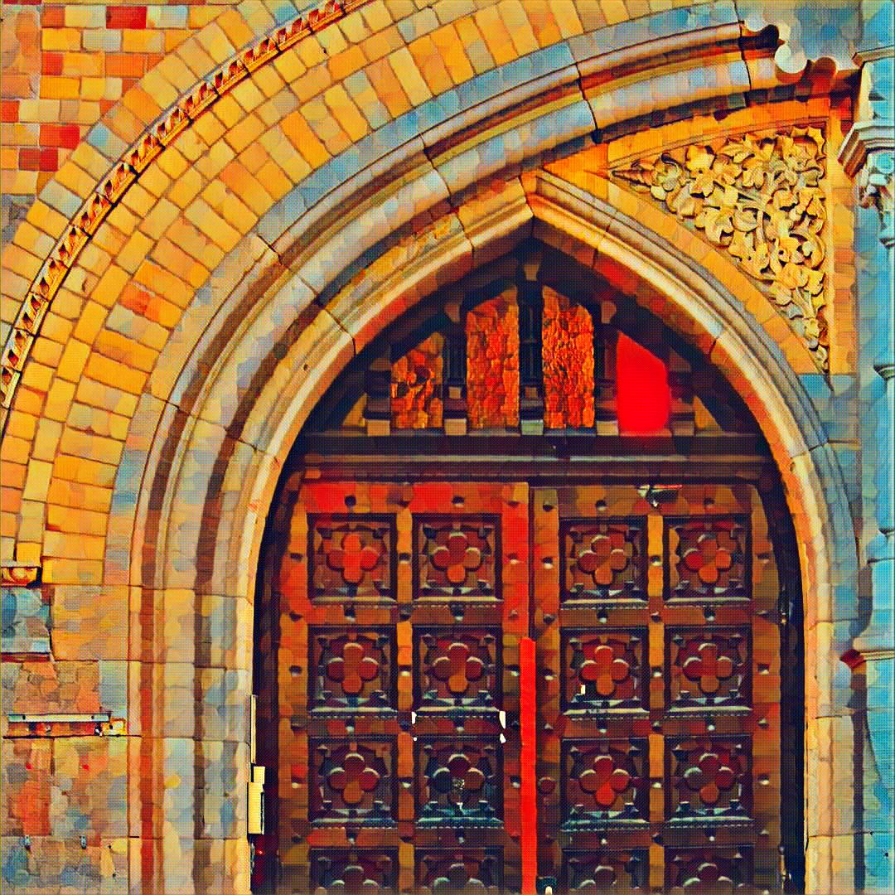
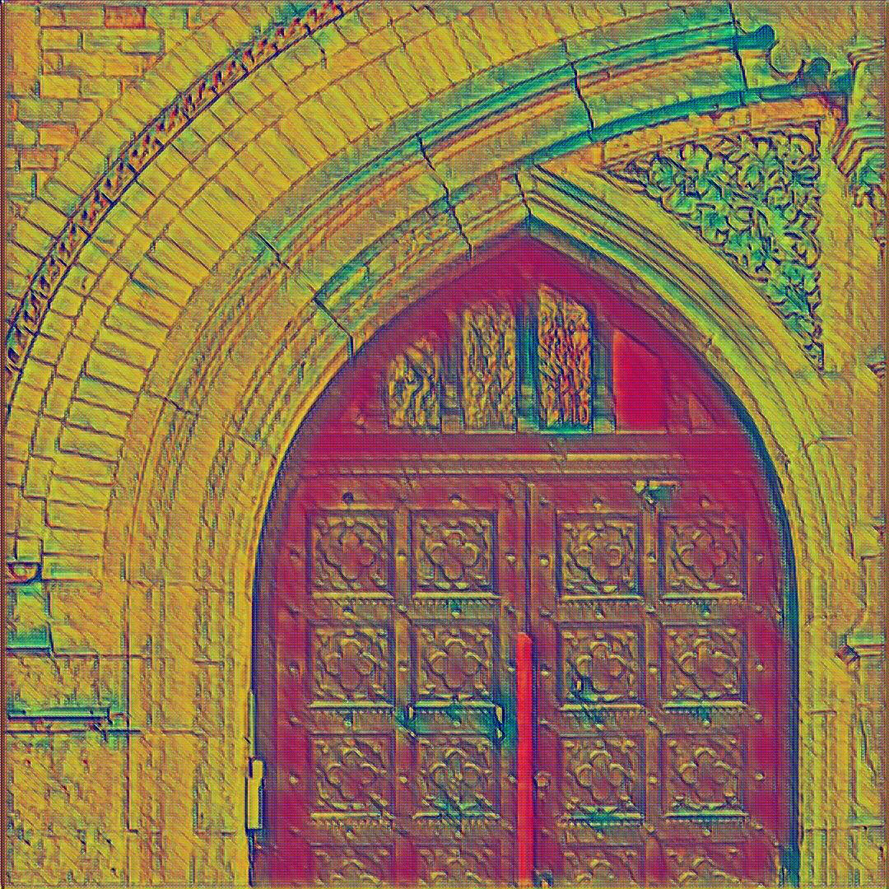
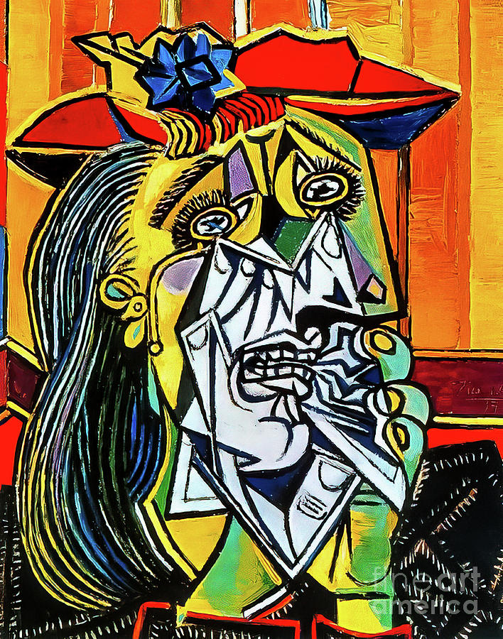
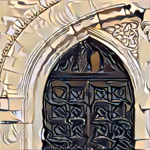

# Fast_neural_style_2

## Giới thiệu
* Tên môn học: Thị giác máy tính nâng cao
* Mã lớp: CS331.N12.KHCL
* Năm học: HK1 (2022-2023)
* Đề tài: Style transfer

### Giảng viên
* TS. Mai Tiến Dũng

### Thành viên nhóm

| Họ tên | MSSV | Email | Github |
| --- | --- | --- | --- | 
| Phạm Trung Hiếu | 19521512 | 19521512@gm.uit.edu.vn |[hieupt123](https://github.com/hieupt123) |
| Võ Khoa Nam | 19521877 | 19521877@gm.uit.edu.vn | [khoanamgit](https://github.com/khoanamgit) |
| Trịnh Minh Hoàng | 19521547 | 19521547@gm.uit.edu.vn | [minhhoangit](https://github.com/minhhoanggit) |

### Đề tài: Style transfer
* Công việc: Triển khai 3 phương pháp thay đổi style hình ảnh

#### 1. Neural style tranfer 
  Triển khai dựa theo bài báo [A Neural Algorithm of Artistic Style](https://arxiv.org/pdf/1508.06576v2.pdf)

  Input:
  | Content image | Style image| 
  | --- | --- |
  |  |  ||
  
  Output: 
  
  

#### 2. Faster Neural style
  Triển khai dựa theo bài báo [Perceptual Losses for Real-Time Style Transfer and Super-Resolution](https://arxiv.org/pdf/1603.08155v1.pdf)
  
  Kết quả
  
  Content image:
  
  
  
  |Style name | Mosaic | rain_princess | vg_la_cafe |
  | --- | --- | --- | --- |
  | Style image |  |    |  |
  | Output |  |  |  | |
  
#### 3. Preserving Color
  Triển khai dựa theo bài báo [Preserving Color in Neural Artistic Style Transfer](https://www.researchgate.net/publication/304163747_Preserving_Color_in_Neural_Artistic_Style_Transfer)
  
 Input:
  | Content image | Style image| 
  | --- | --- |
  |  |  ||
  
  Output: 
  
  
